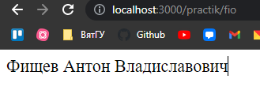
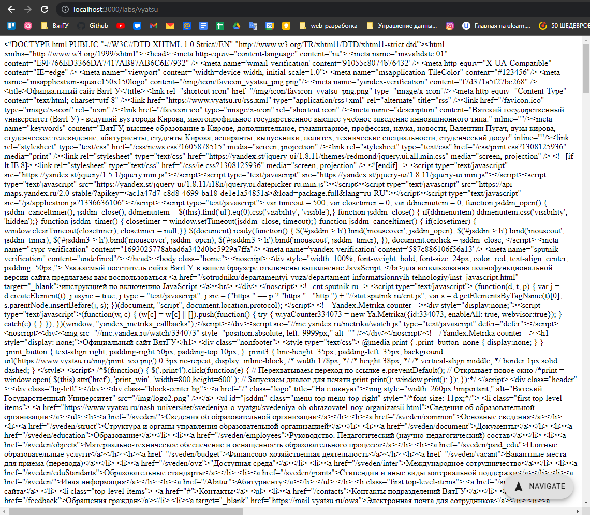

<p align = center>МИНИСТЕРСТВО НАУКИ И ВЫСШЕГО ОБРАЗОВАНИЯ

<p align = center>РОССИЙСКОЙ ФЕДЕРАЦИИ

<p align = center>ФЕДЕРАЛЬНОЕ ГОСУДАРСТВЕННОЕ БЮДЖЕТНОЕ ОБРАЗОВАТЕЛЬНОЕ УЧРЕЖДЕНИЕ ВЫСШЕГО ОБРАЗОВАНИЯ

<p align = center>«ВЯТСКИЙ ГОСУДАРСТВЕННЫЙ УНИВЕРСИТЕТ»

<p align = center>Институт математики и информационных систем

<p align = center>Факультет автоматики и вычислительной техники

<p align = center>Кафедра систем автоматизации управления


<p align = right>Дата сдачи на проверку:

<p align = right>«___» __________ 2022 г.

<p align = right>Проверено:

<p align = right>«___» __________ 2022 г.

<br/>
<br/>

<p align = center>Отчет по лабораторной работе № 1

<p align = center>по дисциплине

<p align = center>«Web-программирование»

<br/>
<br/>
<br/>

<p align = right>Разработал студент гр. ИТб-2301-01-00 ________________ /Фищев А.В./

<p align = right>Проверил _________________ /Земцов М.А./

<p align = right>Работа защищена с оценкой	«___________» «___» __________ 2022 г.

<br/>
<br/>
<br/>


<p align = center>Киров 2022

__________

### Цель: ###

Создание компонентов с ФИО и сайтом университета.


### Задачи: ###

1. Организовать процесс работы над лабораторной работой
2. Подключить веб-фреймворк REACT
3. Подключить сборщик модулей Webpack
4. Подключить и изучить библиотеку Axios
5. Ознакомиться с языком программирования TypeScript
6. Вывести фамилию, имя и отчество в div
7. Вывести сайт ВятГУ

### Ход выполнения: ###

**1. Организовать процесс работы над лабораторной работой**

Создан репозиторий на сайте github.com с названием “web-labs”.


**2. Подключить веб-фреймворк REACT**

Для подключения необходимо изучить Node.js, который предоставляет большой набор встроенных API, которые помогают создавать различные типы приложений, приложения командной строки, веб-приложения и многое другое. Он также предлагает возможности тестирования и отладки и обширную экосистему пакетов сторонних разработчиков, которые можно легко добавлять в приложение.

Node.js является средой выполнения JavaScript, которая использует один цикл событий для параллельных задач.

К новому проекту с помощью node был подключен веб-фреймворк REACT. Приложение создано с помощью программы CRA, с приминением флага <code>--template typescript</code>. 

Листинг App.tsx пресдтавлен в приложении А.


**3. Подключить сборщик модулей Webpack**

Webpack — это статический сборщик модулей. Его основная задача — пакетирование файлов JavaScript для использования в браузере, но он также способен преобразовывать, связывать и упаковывать практически любые ресурсы.

Программа <code>npx create-react-app</code> по умолчанию собирается с применение Webpack и необходимыми настройками.


**4. Подключить и изучить библиотеку Axios**

Axios — это широко известная JavaScript-библиотека. Она представляет собой HTTP-клиент, основанный на промисах и предназначенный для браузеров и для Node.js.

К текущему проекту была подключена библиотека Axios с помощью пакетного менеджера - npm.


**5. Ознакомиться с языком программирования TypeScript**

TypeScript — это язык программирования, в котором исправлены многие недостатки JavaScript. TypeScript является надмножеством языка JavaScript. TypeScript включает функции кода, несовместимые с браузером.

Для установки компилятора TypeScript была применена команда <code>npm install -g typescript</code>.


**6. Вывести фамилию, имя и отчество автора**

В ходе работы был создан новый React компонент c названием Fio. 

Листинг данного компонента представлен в приложении Б.

Отображение фимилии, имени и отчества представлено на рисунке 1.

<br/>

<p align="center">
    
</p>

<p align="center"> Рисунок 1 - Компонент с ФИО

<br/>


**7. Вывести сайт ВятГУ**

Также как и в предыдущем пункте был создан компонент c названием Vyatsu. Листинг данного компонента представлен в приложении В. Вывод с сайтом ВятГУ представлен на рисунке 2.

<p align=center>
    
</p>

<p align = center>Рисунок 2 – Страница получения сайта ВятГУ с помощью axios.

### Вывод: ###
В ходе лабораторной работы были изучены: веб-фреймворк React, сборщик модулей Webpack, библиотека Axios, язык программирования TypeScript. С помощью перечисленных компонентов на практике реализовано отображение на странице фамилии, имени, отчества и сайта ВятГУ.


__________

<p align = center>Приложение А

<p align = center>(обязательное) 

<p align = center>Листинг компонента App.tsx

```tsx
import React from 'react';
import {Routes, Route} from 'react-router-dom';

import {Layout} from './Layout';
import {HomePage} from "./pages/HomePage";
import {FioPage} from "./pages/FioPage";
import {VyatsuPage} from "./pages/VyatsuPage";
import {DashboardPage} from './pages/DashboardPage';
import {AutorizationPage} from "./pages/AutorizationPage";
import {RegistrationPage} from "./pages/RegistrationPage";
import {TablePage} from "./pages/TablePage";


function App() {
    return (
        <div className="App">
            <Routes>
                <Route path={"/"} element={<Layout/>}>
                    <Route index element={<HomePage/>}/>
                    <Route path={"practik"}>
                        <Route path={"fio"} element={<FioPage/>}/>
                        <Route path={"registration"} element={<RegistrationPage/>}/>
                    </Route>
                    <Route path={""}/>
                    <Route path={"labs"}>
                        <Route path={"vyatsu"} element={<VyatsuPage/>}/>
                        <Route path={"autorization"} element={<AutorizationPage/>}/>
                        <Route path={"dashboard"} element={<DashboardPage/>}/>
                        <Route path={"table"} element={<TablePage/>}>
                            <Route path={":id"} element={<TablePage/>}/>
                        </Route>
                    </Route>
                </Route>
            </Routes>
        </div>
    );
}

export default App;
```

__________

<p align = center>Приложение Б

<p align = center>(обязательное) 

<p align = center>Листинг компонента FioPage.tsx

```tsx
import React, {FC} from 'react';
import {Fio} from "../components/Fio/Fio";

interface IFioPageProps {
}

export const FioPage: FC<IFioPageProps> = (props) => {
    return (
        <div>
            <Fio
                lastname={"Фищев"}
                firstname={"Антон"}
                middlename={"Владиславович"}
            />
        </div>
    );
};

```

__________

<p align = center>Приложение B

<p align = center>(обязательное) 

<p align = center>Листинг компонента Vyatsu.tsx

```tsx
import React, {useEffect, useState} from 'react';
import axios from "axios";

import "./Vyatsu.scss"

export const Vyatsu = () => {
    const [source, setSource] = useState();

    const loadVyatsu = (): void => {
        const url = "https://vyatsu.ru"

        axios
            .get(url)
            .then((response) => {
                console.log(response.data)
                setSource(response.data)
            })
            .catch((error) => {
                console.log(error + " Ошибка")
            });
    }

    useEffect(() => {
        loadVyatsu()
    }, [])

    return (
        <div>
            {source}
        </div>
    );
};

```

-------

<p align = center>Приложение Г

<p align = center>(справочное)

<p align = center>Библиографический список

1. Выполнитфе первые шаги с помошью Vue.js [Электронный ресурс] / © Microsoft 2022  // URL:https://docs.microsoft.com/ru-ru/learn/paths/vue-first-steps/. (Дата обращения: 9.02.2022).
1. Создание приложений JavaScript с помощью Node.js [Электронный ресурс] / © Microsoft 2022  // URL:https://docs.microsoft.com/ru-ru/learn/paths/build-javascript-applications-nodejs/. (Дата обращения: 9.02.2022).
1. Создание приложений JavaScript с помощью TypeScript.js [Электронный ресурс] / © Microsoft 2022  // URL:https://docs.microsoft.com/ru-ru/learn/paths/build-javascript-applications-typescript/. (Дата обращения: 9.02.2022).
1. Современный учебник JavaScript [Электронный ресурс] / © 2007—2021 Илья Кантор // Обновлено 19.02.2022. URL:https://learn.javascript.ru/. (Дата обращения: 19.02.2022).
1. Руководство по оформлению Markdown файлов / Artem Zhekov 2015// 2021 GitHub, Inc. URL:<https://gist.github.com/Jekins/2bf2d0638163f1294637>.(Дата обращения: 19.03.2022)
1. Вятский государственный университет [Электронный ресурс]. URL:<https://new.vyatsu.ru> (Дата обращения: 01.03.2022).