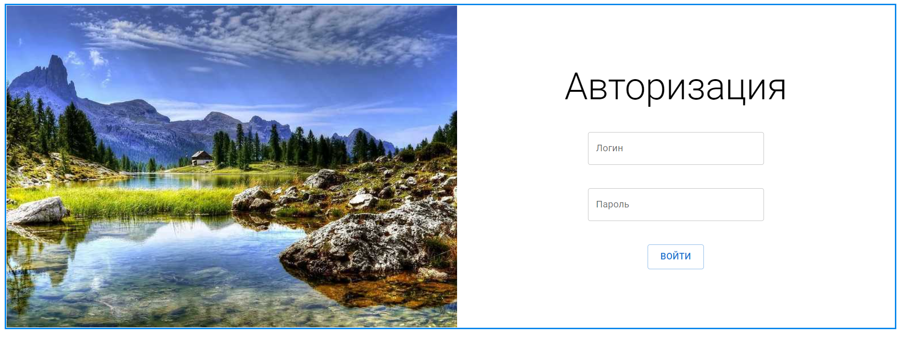
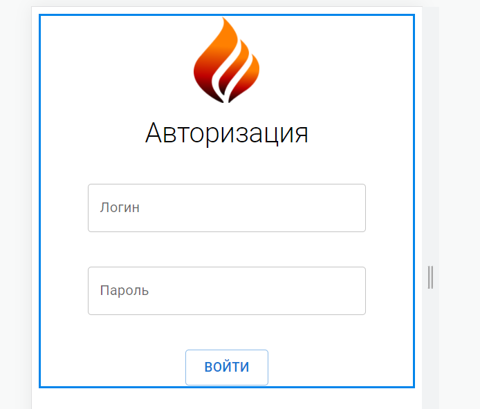

<p align = center>МИНИСТЕРСТВО НАУКИ И ВЫСШЕГО ОБРАЗОВАНИЯ

<p align = center>РОССИЙСКОЙ ФЕДЕРАЦИИ

<p align = center>ФЕДЕРАЛЬНОЕ ГОСУДАРСТВЕННОЕ БЮДЖЕТНОЕ ОБРАЗОВАТЕЛЬНОЕ УЧРЕЖДЕНИЕ ВЫСШЕГО ОБРАЗОВАНИЯ

<p align = center>«ВЯТСКИЙ ГОСУДАРСТВЕННЫЙ УНИВЕРСИТЕТ»

<p align = center>Институт математики и информационных систем

<p align = center>Факультет автоматики и вычислительной техники

<p align = center>Кафедра систем автоматизации управления


<p align = right>Дата сдачи на проверку:

<p align = right>«___» __________ 2022 г.

<p align = right>Проверено:

<p align = right>«___» __________ 2022 г.

<br/>
<br/>

<p align = center>Отчет по лабораторной работе № 2

<p align = center>по дисциплине

<p align = center>«Web-программирование»

<br/>
<br/>
<br/>

<p align = right>Разработал студент гр. ИТб-2301-01-00 ________________ /Фищев А.В./

<p align = right>Проверил _________________ /Земцов М.А./

<p align = right>Работа защищена с оценкой	«___________» «___» __________ 2022 г.

<br/>
<br/>
<br/>


<p align = center>Киров 2022

__________

### Цель: ###

Создание адаптивного компонента авторизации.


### Задачи: ###

1. Создать адаптивный компонент с помощью React.

### Ход выполнения: ###

В ходе выполнения работы был реализован блок регистрации для компьютерной версии сайта,
который содержит в себе: большой логотип, который распологается слева, 
название, два поля ввода для логина и пароля, 
checkBox для сохранения введенных данных и кнопку авторизации. 

Отображаемый на странице блок авторизации представлен на рисунке 1.

<p align="center">
    
</p>

<p align="center"> Рисунок 1 - Блок регистрации для компьютерной версии сайта

<br/>


Для мобильной версии сайта на странице присутствуют все те же компоненты, 
что и для компьютерной, но с некоторыми отличиями: маленький логотип, 
расположенный сверху, подсказки для полей ввода выполнены с помощью атрибута placeholder.

Блок авторизации для мобильных устройств отображен на рисунке 2.

<p align=center>
    
</p>

<p align = center>Рисунок 2 – Блок регистрации для мобильной версии сайта.

### Вывод: ###

в ходе лабораторной работы организовано рабочее пространство, 
закреплены навыки работы с веб-фреймворком React. 
Также были получены навики работы с UI-библеотекой React конпонетнов MUI. 
На практике реализован адаптивный блок авторизации.

__________

<p align = center>Приложение А

<p align = center>(обязательное) 

<p align = center>Листинг компонента Autorization.tsx

```tsx
import React, {FC, useState} from 'react';
import {Alert, Button, Snackbar, Stack, TextField, Typography} from '@mui/material';
import axios from 'axios';
import {typeAlert} from "../../types/Dashboard/typeAlert";

import './Autorization.scss';

interface IAutorizationProps {
}

export const Autorization: FC<IAutorizationProps> = (props) => {
    const {} = props;

    const [login, setLogin] = useState("");
    const [password, setPassword] = useState("");
    const [autorization, setAutorization] = useState(false);
    const [typeAlert, setTypeAlert] = useState<typeAlert>("success");
    const [textAlert, setTextAlert] = useState("");

    const handleLogin = (event: React.ChangeEvent<HTMLInputElement>) => {
        setLogin(event.target.value);
    }

    const handlePassword = (event: React.ChangeEvent<HTMLInputElement>) => {
        setPassword(event.target.value);
    }

    const AutorizationUser = (): void => {
        const url = "https://1f8cb204-3cfc-4796-88aa-35202a2e8d45.mock.pstmn.io"

        let user  = {
            "login": login,
            "password": password
        }

        axios
            .get(url + "/autorization", {
                params: user
            })
            .then((response) => {
                console.log(response)
            })
            .catch((error) => {
                console.error(error);
            })

        setLogin("");
        setPassword("")

        if (login !== "") {
            setTextAlert("Вы успешно зашли")
            setTypeAlert("success")
            setAutorization(true)
        } else {
            setTextAlert("Пользователь не найден")
            setTypeAlert("error")
            setAutorization(true)
        }
    }

    return (
        <>
            <Stack
                alignItems={"center"}
                justifyContent={"center"}
                direction={{
                    xs: 'column',
                    sm: 'column',
                    md: 'row'
                }}
                sx={{
                    border: "3px solid #0085eb"
                }}
            >
                <div className="logo"/>
                <Stack
                    spacing={5}
                    alignItems={"center"}
                    justifyContent={"center"}
                    sx={{
                        flexGrow: 1,
                        width: {
                            xs: '100%',
                            sm: '100%',
                            md: 'auto'
                        }
                    }}
                >
                    <Typography
                        variant={"h2"}
                        sx={{
                            fontSize: {
                                xs: '32px',
                                sm: '32px',
                                md: '64px'
                            }
                        }}
                    >
                        Авторизация
                    </Typography>
                    <TextField
                        label={"Логин"}
                        variant={"outlined"}
                        sx={{
                            width: {
                                xs: '75%',
                                sm: '75%',
                                md: 300
                            }
                        }}
                        value={login}
                        onChange={handleLogin}
                    />
                    <TextField
                        label={"Пароль"}
                        type={"password"}
                        variant={"outlined"}
                        sx={{
                            width: {
                                xs: '75%',
                                sm: '75%',
                                md: 300
                            }
                        }}
                        value={password}
                        onChange={handlePassword}
                    />
                    <Button
                        variant={"outlined"}
                        size={"large"}
                        onClick={AutorizationUser}
                    >
                        Войти
                    </Button>
                </Stack>
            </Stack>

            <Snackbar
                open={autorization}
                onClose={() => {
                    setAutorization(false)
                }}
                autoHideDuration={3000}
            >
                <Alert
                    severity={typeAlert}
                >
                    {textAlert}
                </Alert>
            </Snackbar>


        </>
    );
};

```
