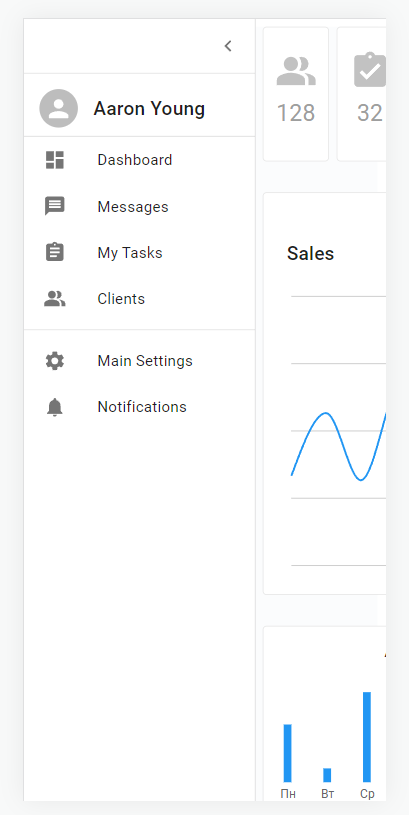

<p align = center>МИНИСТЕРСТВО НАУКИ И ВЫСШЕГО ОБРАЗОВАНИЯ

<p align = center>РОССИЙСКОЙ ФЕДЕРАЦИИ

<p align = center>ФЕДЕРАЛЬНОЕ ГОСУДАРСТВЕННОЕ БЮДЖЕТНОЕ ОБРАЗОВАТЕЛЬНОЕ УЧРЕЖДЕНИЕ ВЫСШЕГО ОБРАЗОВАНИЯ

<p align = center>«ВЯТСКИЙ ГОСУДАРСТВЕННЫЙ УНИВЕРСИТЕТ»

<p align = center>Институт математики и информационных систем

<p align = center>Факультет автоматики и вычислительной техники

<p align = center>Кафедра систем автоматизации управления


<p align = right>Дата сдачи на проверку:

<p align = right>«___» __________ 2022 г.

<p align = right>Проверено:

<p align = right>«___» __________ 2022 г.

<br/>
<br/>

<p align = center>Отчет по лабораторной работе № 4

<p align = center>по дисциплине

<p align = center>«Web-программирование»

<br/>
<br/>
<br/>

<p align = right>Разработал студент гр. ИТб-2301-01-00 ________________ /Фищев А.В./

<p align = right>Проверил _________________ /Земцов М.А./

<p align = right>Работа защищена с оценкой	«___________» «___» __________ 2022 г.

<br/>
<br/>
<br/>


<p align = center>Киров 2022

__________

### Цель: ###

Создание Dashboard`а при помощи фреймворка React


### Задачи: ###

1. Выбрать dashboard-макет в Figma Community
1. Сверстать dashboard-страницу, разбив её на компоненты
1. Реализовать адаптивную верстку под мобильное устройство

### Ход выполнения: ###

1. На электронном ресурсе с готовыми макетами Figma Community был выбран макет, представленный на рисунке 1.

<p align="center">
    
</p>

<p align="center"> Рисунок 1 - Макет Dashboard`а.


2. В ходе выполнения работы были выделены логические компоненты макета, а именно:
Activity, Calendar, LeftMenu, Menu, NewClients, Sales,
Service, ServiceItem, TopStates и Dashboard.

Листинги компонентов представлены в приложении А-Л соответственно.

Реализованный макет представлен на рисунке 2.

<p align="center">
    
</p>

<p align="center"> Рисунок 2 - Реализация макета.


3. С помощью медиа запросов была реализована способность страницы адаптироваться под мобильные устройства. Результат продемонстрирован на рисунке 3.

<p align="center">
    
</p>

<p align="center"> Рисунок 3 - Реализация макета под мобильные устройства.

Навигационная панель слева была перемещена в отдельное меню,
которое появляется по нажатию кнопки, которая распалагается на месте прежней панели.

Меню навигации изображено на рисунке 4.

<p align="center">
    
</p>

<p align = center>Рисунок 4 – Меню навигации

### Вывод: ###

в ходе лабораторной работы организовано рабочее пространство, 
закреплены навыки работы с веб-фреймворком React. 
Также были получены навики работы с UI-библеотекой React конпонетнов MUI. 
На практике реализован Dashboard-макет для компьютеров и мобильных устройств.

__________

<p align = center>Приложение А

<p align = center>(обязательное) 

<p align = center>Листинг компонента Dashboard.tsx

```tsx
import React, {FC} from 'react';
import Service from "./Service";
import Calendar from "./Calendar";
import Activity from "./Activity";
import {IActivityItem} from "../../types/Dashboard/IActivityItem";
import Sales from "./Sales";
import {ISaleItem} from "../../types/Dashboard/ISaleItem";
import TopStates from "./TopStates";
import {ITopStatesItem} from "../../types/Dashboard/ITopStatesItem";
import {Box, Grid, Stack} from "@mui/material";

import "./Dashboard.scss"
import {NewClients} from "./NewClients";
import {INewClient} from "../../types/Dashboard/INewClient";
import {LeftMenu} from "./LeftMenu";

interface IDashboardProps {
    dataActivity: IActivityItem[];
    dataSales: ISaleItem[];
    dataTopStates: ITopStatesItem[];
    dataClients: INewClient[];
}

const Dashboard: FC<IDashboardProps> = (props) => {
    const {
        dataActivity,
        dataSales,
        dataTopStates,
        dataClients
    } = props

    return (
        <div className={"dashboard"}>
            <Stack direction={"row"}>
                <LeftMenu/>
                <Box
                    className={"wrapper"}
                    sx={{
                        display: "grid",
                        gridGap: "32px",
                        gridTemplateColumns: {
                            xs: "80vw",
                            sm: "1fr 1fr",
                            md: "1fr 1fr 1fr",
                        },
                        gridTemplateAreas: {
                            xs: "'service' 'sales' 'activity' 'states' 'clients'",
                            sm: "'service service' 'sales calendar'  'sales activity' 'clients states'",
                            md: "'service service calendar' 'sales sales calendar' 'sales sales activity' 'clients states states'"
                        }
                    }}
                >
                    <Box sx={{gridArea: "service"}}>
                        <Service/>
                    </Box>

                    <Box sx={{gridArea: "sales"}}>
                        <Sales data={dataSales}/>
                    </Box>

                    <Box sx={{gridArea: "calendar", display: {xs: "none", sm: "block"}}}>
                        <Calendar/>
                    </Box>

                    <Box sx={{gridArea: "activity"}}>
                        <Activity data={dataActivity}/>
                    </Box>

                    <Box sx={{gridArea: "states"}}>
                        <TopStates data={dataTopStates}/>
                    </Box>

                    <Box sx={{gridArea: "clients"}}>
                        <NewClients data={dataClients}/>
                    </Box>
                </Box>
            </Stack>
        </div>
    );
};

export default Dashboard;

```

__________

<p align = center>Приложение Б

<p align = center>(обязательное) 

<p align = center>Листинг компонента Activity.tsx

```tsx
import React, {FC} from 'react';
import {Typography} from "@mui/material";
import {Bar, BarChart, Cell, ResponsiveContainer, XAxis} from 'recharts';
import {IActivityItem} from "../../types/Dashboard/IActivityItem";
import "./Activity.scss"

interface IActivityProps {
    data: IActivityItem[];
}

const Activity: FC<IActivityProps> = (props) => {

    return (
        <div className={"activity"}>
            <Typography
                className={"title"}
                alignItems={"center"}
                sx={{
                    m: "16px 0 0 0",
                }}
            >
                Activity
            </Typography>

            <ResponsiveContainer width={"100%"} height={160}>
                <BarChart data={props.data}>
                    <XAxis
                        dataKey="name"
                        axisLine={false}
                        tickLine={false}
                    />
                    <Bar
                        dataKey={"amount"}
                        fill={"#2196F3"}
                        barSize={8}
                    >
                        <Cell/>
                    </Bar>
                </BarChart>
            </ResponsiveContainer>
        </div>
    );
};

export default Activity;

```

__________

<p align = center>Приложение В

<p align = center>(обязательное) 

<p align = center>Листинг компонента Calendar.tsx

```tsx
import React, {FC, useState} from 'react';
import {CalendarPicker, LocalizationProvider} from "@mui/lab";
import AdapterDateFns from '@mui/lab/AdapterDateFns';
import "./Calendar.scss";

interface ICalendarProps {
}

const Calendar: FC<ICalendarProps> = (props) => {
    const [date, setDate] = useState<Date | null>(new Date())

    return (
        <LocalizationProvider
            sx={{
                bgcolor: "#FFF"
            }}
            dateAdapter={AdapterDateFns}
        >
            <CalendarPicker
                className={"calendar"}
                date={date}
                onChange={(newDate) => setDate(newDate)}
            />
        </LocalizationProvider>
    );
};

export default Calendar;

```

__________

<p align = center>Приложение Г

<p align = center>(обязательное) 

<p align = center>Листинг компонента LeftMenu.tsx

```tsx
import * as React from 'react';
import {styled, useTheme, Theme, CSSObject} from '@mui/material/styles';
import Box from '@mui/material/Box';
import MuiDrawer from '@mui/material/Drawer';
import MuiAppBar, {AppBarProps as MuiAppBarProps} from '@mui/material/AppBar';
import Toolbar from '@mui/material/Toolbar';
import List from '@mui/material/List';
import CssBaseline from '@mui/material/CssBaseline';
import Typography from '@mui/material/Typography';
import Divider from '@mui/material/Divider';
import IconButton from '@mui/material/IconButton';
import MenuIcon from '@mui/icons-material/Menu';
import ChevronLeftIcon from '@mui/icons-material/ChevronLeft';
import ChevronRightIcon from '@mui/icons-material/ChevronRight';
import ListItemButton from '@mui/material/ListItemButton';
import ListItemIcon from '@mui/material/ListItemIcon';
import ListItemText from '@mui/material/ListItemText';
import InboxIcon from '@mui/icons-material/MoveToInbox';
import MailIcon from '@mui/icons-material/Mail';
import {FC} from "react";
import {Avatar, ListItem} from "@mui/material";
import {Assignment, Dashboard, Message, Notifications, PeopleAlt, Settings} from "@mui/icons-material";

import "./Menu.scss"

const drawerWidth = 240;

const openedMixin = (theme: Theme): CSSObject => ({
    width: drawerWidth,
    transition: theme.transitions.create('width', {
        easing: theme.transitions.easing.sharp,
        duration: theme.transitions.duration.enteringScreen,
    }),
    overflowX: 'hidden',
});

const closedMixin = (theme: Theme): CSSObject => ({
    transition: theme.transitions.create('width', {
        easing: theme.transitions.easing.sharp,
        duration: theme.transitions.duration.leavingScreen,
    }),
    overflowX: 'hidden',
    width: `calc(${theme.spacing(7)} + 1px)`,
    [theme.breakpoints.up('sm')]: {
        width: `calc(${theme.spacing(8)} + 1px)`,
    },
});

const DrawerHeader = styled('div')(({theme}) => ({
    display: 'flex',
    alignItems: 'center',
    justifyContent: 'flex-end',
    padding: theme.spacing(0, 1),
    ...theme.mixins.toolbar,
}));

const Drawer = styled(MuiDrawer, {shouldForwardProp: (prop) => prop !== 'open'})(
    ({theme, open}) => ({
        width: drawerWidth,
        flexShrink: 0,
        whiteSpace: 'nowrap',
        boxSizing: 'border-box',
        ...(open && {
            ...openedMixin(theme),
            '& .MuiDrawer-paper': openedMixin(theme),
        }),
        ...(!open && {
            ...closedMixin(theme),
            '& .MuiDrawer-paper': closedMixin(theme),
        }),
    }),
);


export const LeftMenu: FC = (props) => {
    const theme = useTheme();
    const [open, setOpen] = React.useState(true);

    return (
        <Box className={"menu"} sx={{display: 'flex'}}>
            <Drawer variant="permanent" open={open}>
                <DrawerHeader>
                    <IconButton onClick={() => {
                        setOpen(!open)
                    }}>
                        {open ? <ChevronLeftIcon/> : <ChevronRightIcon/>}
                    </IconButton>
                </DrawerHeader>
                <Divider/>
                <List>
                    <ListItem>
                        <ListItemIcon sx={{ml: "-5"}}>
                            <Avatar src={"../../assets/images/Dashboard/avatar.png"} sx={{w: 40, h: 40}}/>
                        </ListItemIcon>
                        <ListItemText>
                            <Typography className={"name"}>
                                Aaron Young
                            </Typography>
                        </ListItemText>
                    </ListItem>

                    <Divider/>

                    <ListItem button >
                        <ListItemIcon sx={{pl: 0.5}}>
                            <Dashboard/>
                        </ListItemIcon>
                        <ListItemText>
                            Dashboard
                        </ListItemText>
                    </ListItem>
                    <ListItem button>
                        <ListItemIcon sx={{pl: 0.5}}>
                            <Message/>
                        </ListItemIcon>
                        <ListItemText>
                            Messages
                        </ListItemText>
                    </ListItem>
                    <ListItem button>
                        <ListItemIcon sx={{pl: 0.5}}>
                            <Assignment/>
                        </ListItemIcon>
                        <ListItemText>
                            My Tasks
                        </ListItemText>
                    </ListItem>
                    <ListItem button>
                        <ListItemIcon sx={{pl: 0.5}}>
                            <PeopleAlt/>
                        </ListItemIcon>
                        <ListItemText>
                            Clients
                        </ListItemText>
                    </ListItem>
                </List>
                <Divider/>
                <List>
                    <ListItem button>
                        <ListItemIcon sx={{pl: 0.5}}>
                            <Settings/>
                        </ListItemIcon>
                        <ListItemText>
                            Main Settings
                        </ListItemText>
                    </ListItem>
                    <ListItem button>
                        <ListItemIcon sx={{pl: 0.5}}>
                            <Notifications/>
                        </ListItemIcon>
                        <ListItemText>
                            Notifications
                        </ListItemText>
                    </ListItem>
                </List>
            </Drawer>
        </Box>
    );
}
```
__________

<p align = center>Приложение Д

<p align = center>(обязательное) 

<p align = center>Листинг компонента Menu.tsx

```tsx
import React, {FC} from 'react';
import {Avatar, Divider, List, ListItem, ListItemIcon, ListItemText, Stack, Toolbar, Typography} from "@mui/material";
import "./Menu.scss"
import {Assignment, Dashboard, Message, Notifications, PeopleAlt, Settings} from "@mui/icons-material";

interface MenuProps {
}

const Menu: FC<MenuProps> = (props) => {
    return (
        <Stack className={"menu"} direction={"column"}>
            <Avatar src={"../../assets/images/Dashboard/avatar.png"}
                    sx={{
                        w: 40,
                        h: 40
                    }}
            />

            <Typography
                className={"name"}
            >
                Aaron Young
            </Typography>
            <Divider/>
            <List>
                <ListItem button>
                    <ListItemIcon>
                        <Dashboard/>
                    </ListItemIcon>
                    <ListItemText>
                        Dashboard
                    </ListItemText>
                </ListItem>
                <ListItem button>
                    <ListItemIcon>
                        <Message/>
                    </ListItemIcon>
                    <ListItemText>
                        Messages
                    </ListItemText>
                </ListItem>
                <ListItem button>
                    <ListItemIcon>
                        <Assignment/>
                    </ListItemIcon>
                    <ListItemText>
                        My Tasks
                    </ListItemText>
                </ListItem>
                <ListItem button>
                    <ListItemIcon>
                        <PeopleAlt/>
                    </ListItemIcon>
                    <ListItemText>
                        Clients
                    </ListItemText>
                </ListItem>
            </List>
            <Divider/>
            <List>
                <ListItem button>
                    <ListItemIcon>
                        <Settings/>
                    </ListItemIcon>
                    <ListItemText>
                        Main Settings
                    </ListItemText>
                </ListItem>
                <ListItem button>
                    <ListItemIcon>
                        <Notifications/>
                    </ListItemIcon>
                    <ListItemText>
                        Notifications
                    </ListItemText>
                </ListItem>
            </List>

        </Stack>
    );
};

export default Menu;

```

__________

<p align = center>Приложение Е

<p align = center>(обязательное) 

<p align = center>Листинг компонента NewClients.tsx

```tsx
import React, {FC} from 'react';
import {Typography} from "@mui/material";

import "./NewClients.scss"
import {INewClient} from "../../types/Dashboard/INewClient";
import {NewClientsItem} from "./NewClientsItem";

interface INewClientsProps {
    data: INewClient[]
}

export const NewClients: FC<INewClientsProps> = (props) => {
    return (
        <div className={"new-clients"}>
            <Typography className={"title"}>
                New Clients
            </Typography>

            {
                props.data.map((item, index) => {
                    return <NewClientsItem name={item.name} city={item.city} key={item.name}/>
                })
            }
        </div>
    );
};

```

__________

<p align = center>Приложение Ж

<p align = center>(обязательное) 

<p align = center>Листинг компонента Sales.tsx

```tsx
import React, {FC} from 'react';
import {Typography} from "@mui/material";
import {CartesianGrid, Line, LineChart, ResponsiveContainer, Tooltip, YAxis} from 'recharts';
import {ISaleItem} from "../../types/Dashboard/ISaleItem";
import "./Sales.scss"

interface ISalesProps {
    data: ISaleItem[]
}

const Sales: FC<ISalesProps> = (props) => {
    return (
        <div
            className={"sales"}
        >
            <Typography
                className={"title"}
                sx={{
                    m: "24px 0",
                }}
            >
                Sales
            </Typography>

            <ResponsiveContainer width={"100%"} height={290}>
                <LineChart
                    data={props.data}
                >
                    <CartesianGrid
                        vertical={false}
                    />
                    <YAxis
                        dataKey={"money"}
                        axisLine={false}
                        orientation={"right"}
                        tickLine={false}
                        type={"number"}
                    />
                    <Tooltip
                        labelStyle={{
                            display: "none"
                        }}
                        itemStyle={{
                            fontFamily: "Roboto",
                            fontStyle: "normal",
                            fontWeight: "400",
                            fontSize: "12px",
                            lineHeight: "15px",

                            display: "flex",
                            alignItems: "center",
                            textAlign: "center",
                            letterSpacing: "0.4px",

                            color: "rgba(0, 0, 0, 0.6)",
                        }}
                        cursor={false}
                        formatter={(value: number, name: string) => [`$ ${value}`]}
                    />
                    <Line
                        type={"monotone"}
                        dataKey="money"
                        stroke="#2196F3"
                        strokeWidth={2}
                        dot={false}
                    />
                </LineChart>
            </ResponsiveContainer>

        </div>
    );
};

export default Sales;

```

__________

<p align = center>Приложение З

<p align = center>(обязательное) 

<p align = center>Листинг компонента Service.tsx

```tsx
import React, {FC} from 'react';
import ServiceItem from "./ServiceItem";
import {AssignmentTurnedIn, Notifications, PeopleAlt, Report} from '@mui/icons-material';
import {Grid, Stack} from "@mui/material";

interface ServiceProps {
}

const Service: FC<ServiceProps> = (props) => {
    return (
        <Stack spacing={{xs: 1, sm: 1, md: 2, lg: 4}} direction={"row"}>
            <ServiceItem count={128} text={"Clients"}>
                <PeopleAlt sx={{fontSize: 44,}}/>
            </ServiceItem>

            <ServiceItem count={32} text={"Completed tasks"}>
                <AssignmentTurnedIn sx={{fontSize: 44,}}/>
            </ServiceItem>

            <ServiceItem count={2} text={"Notifications"}>
                <Notifications sx={{fontSize: 44,}}/>
            </ServiceItem>

            <ServiceItem count={4} text={"Reports"}>
                <Report sx={{fontSize: 44,}}/>
            </ServiceItem>
        </Stack>
    );
};

export default Service;

```

__________

<p align = center>Приложение К

<p align = center>(обязательное) 

<p align = center>Листинг компонента ServiceItem.tsx

```tsx
import React, {FC} from 'react';
import {Button, Icon, Stack, Typography} from "@mui/material";
import "./ServiceItem.scss"

interface ServiceItemProps {
    count: number;
    text: string;
}

const ServiceItem: FC<ServiceItemProps> = (props) => {
    return (
        <>
            <Button
                className="service-item"
                sx={{
                    m: 0,
                    p: 0,
                    bgcolor: "#FFF",
                    color: "#0000003D;"
                }}
            >
                <Stack
                    alignItems={"center"}
                    justifyContent={"center"}
                    className={"content"}
                >
                    {props.children}
                    <Typography className={"count"}>
                        {props.count}
                    </Typography>
                    <Typography className={"text"}>
                        {props.text}
                    </Typography>
                </Stack>
            </Button>
        </>
    );
};

export default ServiceItem;

```

__________

<p align = center>Приложение Л

<p align = center>(обязательное) 

<p align = center>Листинг компонента TopStates.tsx


```tsx
import React, {FC} from 'react';
import {Typography} from "@mui/material";
import "./TopStates.scss"
import {Bar, BarChart, CartesianGrid, ResponsiveContainer, XAxis, YAxis} from 'recharts';
import {ITopStatesItem} from "../../types/Dashboard/ITopStatesItem";

interface ITopStatesProps {
    data: ITopStatesItem[]
}

const TopStates: FC<ITopStatesProps> = (props) => {
    return (
        <div className={"top-states"}>
            <Typography className={"title"}>
                Top States
            </Typography>

            <ResponsiveContainer width={"90%"} height={250}>
                <BarChart
                    layout={"vertical"}
                    data={props.data}
                    width={750}
                    height={230}
                >
                    <CartesianGrid horizontal={false}/>
                    <XAxis
                        type="number"
                        domain={[0, (dataMax: number) => (Math.ceil(dataMax / 1000 ) * 1000)]}
                        tickLine={false}
                        axisLine={false}
                    />
                    <YAxis
                        type={"category"}
                        dataKey={"name"}
                        tickLine={false}
                    />
                    <Bar
                        dataKey={"var1"}
                        fill={"#2196F3"}
                        barSize={8}
                    />
                    <Bar
                        dataKey={"var2"}
                        fill={"#1976D2"}
                        barSize={8}
                    />
                </BarChart>
            </ResponsiveContainer>

        </div>
    );
};

export default TopStates;

```


