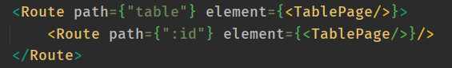

<p align = center>МИНИСТЕРСТВО НАУКИ И ВЫСШЕГО ОБРАЗОВАНИЯ

<p align = center>РОССИЙСКОЙ ФЕДЕРАЦИИ

<p align = center>ФЕДЕРАЛЬНОЕ ГОСУДАРСТВЕННОЕ БЮДЖЕТНОЕ ОБРАЗОВАТЕЛЬНОЕ УЧРЕЖДЕНИЕ ВЫСШЕГО ОБРАЗОВАНИЯ

<p align = center>«ВЯТСКИЙ ГОСУДАРСТВЕННЫЙ УНИВЕРСИТЕТ»

<p align = center>Институт математики и информационных систем

<p align = center>Факультет автоматики и вычислительной техники

<p align = center>Кафедра систем автоматизации управления


<p align = right>Дата сдачи на проверку:

<p align = right>«___» __________ 2022 г.

<p align = right>Проверено:

<p align = right>«___» __________ 2022 г.

<br/>
<br/>

<p align = center>Отчет по лабораторной работе № 5

<p align = center>по дисциплине

<p align = center>«Web-программирование»

<br/>
<br/>
<br/>

<p align = right>Разработал студент гр. ИТб-2301-01-00 ________________ /Фищев А.В./

<p align = right>Проверил _________________ /Земцов М.А./

<p align = right>Работа защищена с оценкой	«___________» «___» __________ 2022 г.

<br/>
<br/>
<br/>


<p align = center>Киров 2022

__________

### Цель: ###

Провести тестирование отправки axios-запроса на mock-сервер


### Задачи: ###

1. Отправить get запрос на mock-сервер и получить ответ
2. Вывод таблицы с информацией из запроса при загрузке страницы
3. Создание модального окна при нажатии на строку таблицы

### Ход выполнения: ###

1. Отправить get запрос на mock-сервер и получить ответ

В ходе лабораторной работы был создан новый mock-сервер в Postman. 
Для вывода информации в таблицу был написан Get-запрос, представленный на рисунке 1. 

<p align=center>
    
</p>

<p align = center>Рисунок 1 – Get-запрос

Запрос выполняется с помощью библиотеки axios в функции <code>getUsers</code> компонента TablePage. 
Листинг TablePage представлен в приложении Б.

2. Вывод таблицы с информацией из запроса при загрузке страницы

В ходе всех лабораторный работ создается единое SPA на React TS,
в нем выполняется маршрутизация при помощи библиотеки react-router-dom.
Листинг компонта App представлен в приложении А.

При помощи компонента Route и его вложенной структуре (рис. 2) можно вывести как всю таблицу, 
так и отдельную строку по id через хук useParams.

<p align=center>
    
</p>

<p align = center>Рисунок 2 – Листинг Route


Таблица взята из библиотеки UI-компонентов MUI (рис. 3).

<p align=center>
    
</p>

<p align = center>Рисунок 3 – Таблица с информацией из запроса

Листинг таблицы представлен в приложении В.

При указании конкретного id через слеш в поисковой строке,
выведеться только только строка с данным id (рис. 4). 

<p align=center>
    
</p>

<p align = center>Рисунок 4 – Таблица при указании конкретного id


3. Создание модального окна при нажатии на строку таблицы

При нажатии из строки выводиться модальное окно из библиотеки UI-компонентов MUI,
с информацией об обьекте расположенном в этой строке (рис. 5).

<p align=center>
    
</p>

<p align = center>Рисунок 5 – Модальное окно.

Листинг модального окна также представлен в приложении В.

### Вывод: ###

в ходе выполнения лабораторной работы были получены данные с mock-сервера 
и организовано взаимодействие пользователя с ними. Данные отображены в таблицу,
при нажатии на строку таблицы открывается модальное окно с полной информацией.

__________

<p align = center>Приложение А

<p align = center>(обязательное) 

<p align = center>Листинг компонента Dashboard.tsx

```tsx
import React from 'react';
import {Routes, Route} from 'react-router-dom';

import {Layout} from './Layout';
import {HomePage} from "./pages/HomePage";
import {FioPage} from "./pages/FioPage";
import {VyatsuPage} from "./pages/VyatsuPage";
import {DashboardPage} from './pages/DashboardPage';
import {AutorizationPage} from "./pages/AutorizationPage";
import {RegistrationPage} from "./pages/RegistrationPage";
import {TablePage} from "./pages/TablePage";


function App() {
    return (
        <div className="App">
            <Routes>
                <Route path={"/"} element={<Layout/>}>
                    <Route index element={<HomePage/>}/>
                    <Route path={"practik"}>
                        <Route path={"fio"} element={<FioPage/>}/>
                        <Route path={"registration"} element={<RegistrationPage/>}/>
                    </Route>
                    <Route path={""}/>
                    <Route path={"labs"}>
                        <Route path={"vyatsu"} element={<VyatsuPage/>}/>
                        <Route path={"autorization"} element={<AutorizationPage/>}/>
                        <Route path={"dashboard"} element={<DashboardPage/>}/>
                        <Route path={"table"} element={<TablePage/>}>
                            <Route path={":id"} element={<TablePage/>}/>
                        </Route>
                    </Route>
                </Route>
            </Routes>
        </div>
    );
}

export default App;

```

__________

<p align = center>Приложение Б

<p align = center>(обязательное) 

<p align = center>Листинг компонента TablePage.tsx

```tsx
import React, {FC, useEffect, useState} from 'react';
import { MyTable } from '../components/Table/MyTable';
import {useParams} from "react-router-dom";
import {IUser} from "../types/IUser";
import axios from 'axios';

interface ITablePageProps {
}

export const TablePage: FC<ITablePageProps> = (props) => {
    let { id } = useParams()

    const [dataTable, setDataTable] = useState<IUser[]>([]);

    const getUsers = (id: number) => {
        const URL = "https://91f6e1d9-e137-415e-af36-89f3be0bf9d0.mock.pstmn.io";

        axios
            .get(URL + "/user")
            .then((res) => {
                console.log(res.data);
                setDataTable([])
                for (let i = 0; i < res.data.length; i++) {
                    let newUser: IUser = {
                        "id": res.data[i].id,
                        "lastname": res.data[i].lastname,
                        "firstname": res.data[i].firstname,
                        "middlename": res.data[i].middlename,
                        "dataOfBirth": res.data[i].dataOfBirth,
                        "age": res.data[i].age,
                        "email": res.data[i].email
                    }

                    setDataTable(oldDataTable => [...oldDataTable, newUser])
                };
                if (id) {
                    let currentUser: IUser | null = null;

                    for (let i = 0; i < dataTable.length; i++) {
                        if (dataTable[i].id === id) {
                            currentUser = dataTable[i]
                        }
                    }

                    if (currentUser) {
                        setDataTable([currentUser]);
                    }
                }
            })
            .catch(error => {
                console.log(error);
            })
    }

    useEffect(() => {
        getUsers(Number(id))
    }, []);


    return (
        <div>
            <MyTable data={dataTable} searchId={Number(id)}/>
        </div>
    );
};

```

__________

<p align = center>Приложение В

<p align = center>(обязательное) 

<p align = center>Листинг компонента MyTable.tsx

```tsx
import {
    Paper,
    TableBody,
    TableCell,
    TableContainer,
    TableHead,
    TableRow,
    Table,
    Box,
    Modal,
    Typography, 
    Stack
} from '@mui/material';
import React, {FC, useState} from 'react';
import {IUser} from "../../types/IUser";

import "./MyTable.scss"

const style = {
    position: 'absolute' as 'absolute',
    top: '50%',
    left: '50%',
    transform: 'translate(-50%, -50%)',
    width: 400,
    bgcolor: 'background.paper',
    border: '2px solid #000',
    boxShadow: 24,
    p: 4,
    fontSize: 28
};

interface ITableProps {
    data: IUser[],
    searchId?: number
}

export const MyTable: FC<ITableProps> = (props) => {
    let data = props.data;

    const [open, setOpen] = useState(false);
    const [user, setUser] = useState<IUser | null>()

    const handleOpen = (item: IUser | null) => {
        if (item) {
            setUser(item)
            setOpen(true)
        }
    };
    const handleClose = () => setOpen(false);

    if (props.searchId) {
        data = data.filter((item) => {
            return item.id === props.searchId
        })
    }

    return (
        <>
            <TableContainer sx={{maxWidth: "90%", m: '25px auto'}} component={Paper}>
                <Table aria-label="simple table">
                    <TableHead>
                        <TableRow>
                            <TableCell align={"center"}>ID</TableCell>
                            <TableCell align={"center"}>Фамилия</TableCell>
                            <TableCell align={"center"}>Имя</TableCell>
                            <TableCell align={"center"}>Отчество</TableCell>
                            <TableCell align={"center"}>Дата рождения</TableCell>
                            <TableCell align={"center"}>Возраст</TableCell>
                            <TableCell align={"center"}>Почта</TableCell>
                        </TableRow>
                    </TableHead>
                    <TableBody>
                        {
                            data.map((item) => {
                                return (
                                    <TableRow className={"table-row"} key={item.id} onClick={() => {
                                        handleOpen(item)
                                    }}>
                                        <TableCell className={"table-item"} align={"center"}>
                                            {item.id.toString()}
                                        </TableCell>
                                        <TableCell className={"table-item"} align={"center"}>
                                            {item.firstname}
                                        </TableCell>
                                        <TableCell className={"table-item"} align={"center"}>
                                            {item.lastname}
                                        </TableCell>
                                        <TableCell className={"table-item"} align={"center"}>
                                            {item.middlename}
                                        </TableCell>
                                        <TableCell className={"table-item"} align={"center"}>
                                            {item.dataOfBirth}
                                        </TableCell>
                                        <TableCell className={"table-item"} align={"center"}>
                                            {item.age}
                                        </TableCell>
                                        <TableCell className={"table-item"} align={"center"}>
                                            {item.email}
                                        </TableCell>
                                    </TableRow>
                                )
                            })
                        }

                    </TableBody>
                </Table>
            </TableContainer>

            <Modal open={open} onClose={handleClose}>
                <Box sx={style}>
                    {
                        user
                            ? <Stack direction={"column"}>
                                <Typography><b>Фамилия</b>: {user.lastname}</Typography>
                                <Typography><b>Имя</b>: {user.firstname}</Typography>
                                <Typography><b>Отчество</b>: {user.middlename}</Typography>
                                <Typography><b>Дата рождения</b>: {user.dataOfBirth}
                                </Typography>
                                <Typography><b>Возраст</b>: {user.age}</Typography>
                                <Typography><b>Почта</b>: {user.email}</Typography>
                            </Stack>
                            : <Typography> Пользователь не найден</Typography>
                    }
                </Box>
            </Modal>
        </>
    );
};

```

__________

<p align = center>Приложение А

<p align = center>(обязательное) 

<p align = center>Листинг компонента Dashboard.tsx

```tsx

```